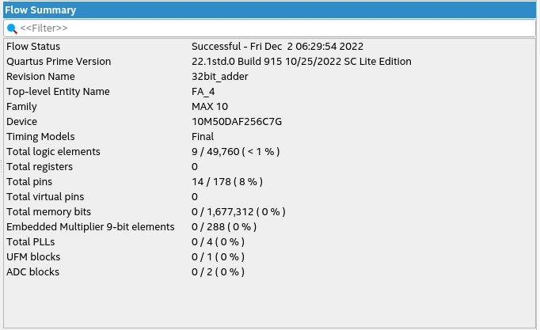

# CADD - Sem 3 Programs
- This repository contains programs from CADD class notes and projects

## Unit 4
- Consists of different types of D-flip flops, 3:8 decoder, 7-segment 
decoder, 4-bit up counters, priority encoder and Divide by 3 FSM

## Unit 5
- Consists of Carry look-ahead adders, prefix adders, ripple carry adders, 
binary multipliers, comparaters and basic RAM and ROM modules

## 2-bit Comparator
- A 2-bit comparator built without using `<`, `>` and `==` operators
- RTL Diagram

- Waveforms Diagram

- Flow Summary

- Pin planner

## 32-bit RCA
- 32-bit RCA built using structural programming
- Half Adder diagram

- 1-bit full adder diagram

- 4-bit full adder diagram

- 32-bit Full adder diagram

- Structural diagram

- Pin planner

- Flow summary

- Waveform

